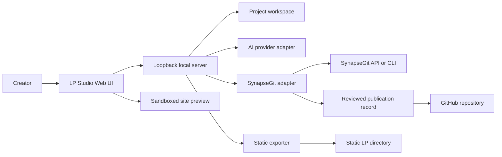

# SynapseGit LP Studio current specification

Status: product target; not a statement of current implementation

Last updated: 2026-07-20

Repository: `howlrs/synapsegit-lp-studio`

> **読み方:** 本書は製品方向と将来の要求を記述します。本書の「できる」
> 「supportする」は、現在のruntimeで実装済みという証拠ではありません。
> 現在の事実は[実装ステータス](implementation-status.md)と
> [要件traceability](requirements-traceability.md)を確認してください。

## 1. Purpose

SynapseGit LP Studio is a local-first web application for creating a landing
page through communication with AI. The creator can identify a visual target
in the page, describe a requested change, inspect the AI proposal, and make a
Human Decision before applying it.

The application uses SynapseGit as the provenance and decision foundation, but
remains a separate product and repository. A generated landing page must work
without LP Studio or SynapseGit.

The project also exists to produce a concrete SynapseGit adoption case. LP
creation proposals, Human Decisions, and selected provenance information are
recorded through SynapseGit. A creator-approved, privacy-filtered GitHub-ready
record is generated locally; any actual GitHub write is a separate explicit
operation. This repository and resulting project records should make it
possible to evaluate how SynapseGit works in a real AI-assisted creation flow,
not only in fixtures or demonstrations.

## 2. Product principles

1. The creator can always see which page region or element an instruction
   applies to.
2. AI output is a proposal. It does not silently replace the accepted page.
3. Editor state and provenance metadata never leak into the exported site.
4. The initial application is single-user and loopback-only.
5. SynapseGit integration uses a versioned adapter boundary. The editor does
   not access SynapseGit's Ref database or low-level mutation primitives.
6. The editable site remains ordinary HTML, CSS, JavaScript, and assets rather
   than a proprietary runtime format.

## 3. Primary user flow

1. Create a project from a blank page, or import an existing static LP.
2. Open the page in the embedded preview.
3. Select a page, semantic block, DOM element, text, point, or blank visual
   region.
4. Add a natural-language request, optionally with project-wide context.
5. AI produces a bounded file change proposal.
6. Inspect the rendered result and the changed files.
7. Adopt, reject, or defer the proposal.
8. Continue iterating from the latest adopted state.
9. Export only the accepted site as static files.
10. Review selected provenance information, generate GitHub-ready files, and
    optionally perform a separate explicit GitHub publication action.

## 4. Functional requirements

### 4.1 Project lifecycle

- Create a project with a minimal blank `index.html`.
- Import a bounded directory containing an existing static site.
- Open, rename, and inspect locally registered projects.
- Save editor metadata separately from site files.
- Preserve an accepted revision independently of pending AI proposals.
- Refuse paths that escape the registered project root.

The initial import target is one static site with one primary entry point. A
multi-page site may be loaded if all navigation is relative, but dedicated
multi-page editing workflows are not part of the first milestone.

### 4.2 Preview and target selection

- Render the site in a sandboxed preview frame on a dedicated unprivileged
  origin controlled by the same local application.
- Support desktop, tablet, and mobile viewport presets.
- Select an element by clicking its rendered box.
- Select text and retain a text quote as an additional anchor.
- Select a semantic or heuristic page block.
- Select a blank point by coordinates.
- Select a blank region by dragging a rectangle.
- Display the active target as an overlay without modifying exported site
  markup.
- Re-resolve an annotation after a proposal changes the DOM.
- Mark a target as ambiguous or detached instead of silently binding it to a
  different element.

Coordinates alone are not a stable identity. A target combines semantic and
visual anchors where available:

```json
{
  "page": "index.html",
  "kind": "element",
  "elementId": "hero-heading",
  "domPath": "main > section.hero > h1",
  "textQuote": "未来の働き方を",
  "normalizedRect": {
    "x": 0.12,
    "y": 0.18,
    "width": 0.55,
    "height": 0.08
  },
  "viewport": {
    "width": 1440,
    "height": 900
  }
}
```

For a blank region, `kind` is `region`; the normalized rectangle and viewport
are required while DOM fields are optional contextual anchors.

### 4.3 AI communication

- Keep a project conversation and proposal-specific messages.
- Include the selected target, relevant DOM, relevant CSS, viewport, user
  request, and bounded neighboring context in the AI request.
- Allow a request without a selected target for page-wide changes.
- Show the context that will be sent before execution, excluding secrets.
- Require the model result to conform to an application-owned change protocol.
- Validate requested file operations before applying them to a proposal
  workspace.
- Do not give the model an unrestricted filesystem path or shell capability.
- Keep provider-specific request and response objects behind an AI adapter.

The AI change protocol must represent explicit create, update, rename, and
delete operations with bounded relative paths. Version 1 uses preconditioned
full-text file replacement for updates; structured patches are a later
versioned extension. The proposal result must be deterministic after
validation.

### 4.4 Proposal review and Human Decision

- Build each AI proposal in an isolated proposal workspace.
- Preview the proposal without replacing the accepted workspace.
- Show changed files and a textual diff where practical.
- Support `adopt`, `reject`, and `defer`.
- Treat all three dispositions as terminal for that proposal. Resuming a
  deferred proposal creates a new proposal linked to the old one.
- Limit MVP adoption to the unchanged whole proposal; partial or modified
  adoption requires a future SynapseGit profile.
- Apply an adopted proposal only when its base revision still matches the
  current accepted revision.
- Keep rejected and deferred proposals available as history.
- Record the user request, resolved target, model attribution, input base,
  output identity, and Human Decision through the SynapseGit adapter.
- Never describe caller-supplied or externally modified content as verified AI
  output unless the execution boundary can support that claim.

### 4.5 Static export

- Export the accepted `site/` state, never a pending proposal.
- Produce a directory containing `index.html`, CSS, JavaScript, images, fonts,
  and other site-owned assets.
- Use relative links or another explicitly selected static hosting base.
- Exclude chat history, annotations, prompts, credentials, provider responses,
  internal revision data, and SynapseGit repository data.
- Refuse symlinks or resolved paths that escape the site root.
- Validate that the entry point and referenced local files exist.
- Produce the same exported bytes from the same accepted revision and export
  options.
- Permit the result to be served by an unprivileged local static HTTP server or
  deployed to ordinary static hosting without LP Studio runtime code. Direct
  `file://` compatibility is an explicit export profile, not an MVP guarantee.

The logical project boundary is:

```text
project/
  site/                  editable and exportable LP files
  .studio/               local editor state; never exported
    project.json
    conversation.json
    annotations.json
    revisions/
```

### 4.6 GitHub record and SynapseGit adoption case

- Treat the LP Studio development repository and creator-approved project
  records as a real SynapseGit integration case.
- Generate a provider-neutral, human-readable and machine-readable summary from
  SynapseGit-supported data before GitHub publication.
- Let the creator inspect exactly which files and fields will be recorded.
- Require an explicit Human action before any commit, push, issue creation, pull
  request creation, or other GitHub write.
- Record the SynapseGit contract version, LP Studio version, project/revision
  identity, proposal attribution, and Human Decision where the available
  SynapseGit projection can support those claims.
- Exclude private rationale, prompts, credentials, raw provider responses,
  local filesystem paths, internal authority values, and data not selected for
  publication.
- Keep the static LP export independent from the GitHub provenance record. A
  user may export a site without publishing its creation history.
- Do not claim that GitHub is the SynapseGit authority or archive. GitHub stores
  a derived adoption record; SynapseGit remains the provenance and decision
  source.
- Preserve a reproducible link between a published record and the accepted LP
  revision using supported checksums or object identities.

The preferred initial delivery form is a reviewed set of files suitable for a
normal Git commit, using SynapseGit's provider-neutral publication output where
available. Automated GitHub upload is a separate operation and must not be
inferred from generating GitHub-ready files.

This product-publication rule is distinct from the development repository
checkpoint commits, pushes, and explicitly approved development-baseline
merges authorized for implementation progress in
[implementation-plan.md](implementation-plan.md).

## 5. System boundary



The browser UI does not receive arbitrary local filesystem access. The local
server owns project registration, path resolution, AI credentials, proposal
validation, export, and SynapseGit communication.

## 6. Repository architecture

The intended repository layout is:

```text
apps/
  web/                  editor, conversation, overlay, preview and review UI
  local-server/         loopback HTTP, project, AI and filesystem authority
packages/
  editor-protocol/      target, annotation and message contracts
  site-model/           project and accepted/proposal revision models
  exporter/             deterministic static output
  synapsegit-adapter/   versioned provenance and Human Decision integration
docs/
  current-specification.md
```

A TypeScript client application is justified by selection overlays, iframe
coordination, responsive preview state, and proposal comparison. The exact
framework, package manager, server language, and build system are not fixed by
this specification.

## 7. Core data concepts

| Concept | Meaning |
| --- | --- |
| Project | Registered local LP workspace and editor metadata |
| Accepted revision | Current Human-approved site state |
| Proposal | AI-attributed candidate derived from one accepted revision |
| Target | Element, text, region, or page-wide instruction anchor |
| Annotation | Target plus creator request and display context |
| Decision | Human `adopt`, `reject`, or `defer` result |
| Export | Static files derived from one accepted revision |
| Conversation | Project and proposal messages; never part of site output |

Identifiers must be application-generated opaque values. Relative file paths,
DOM paths, labels, and model-generated strings are not authority identifiers.

## 8. SynapseGit integration

SynapseGit and LP Studio are sibling repositories. Git submodules and nested
Git repositories are not part of the design.

The adapter is responsible for translating LP Studio events into supported
SynapseGit operations. It must:

- pin a supported SynapseGit contract or CLI version;
- distinguish proposal attribution from verified model execution;
- keep Human Decision authority outside browser-controlled identifiers;
- fail closed when a proposal base is stale;
- avoid direct access to `refs.sqlite3`, raw CAS writes, or
  `Repository::update_ref`;
- report integration failure without corrupting the accepted LP workspace.

For the adoption-case objective, the adapter or a later publication adapter
also prepares creator-approved records for GitHub. GitHub publication is not a
replacement for SynapseGit archive export, and the current SynapseGit
`github`-target publication layout must not be described as uploading by
itself.

The existing SynapseGit localhost Creator Pilot is image-oriented and does not
invoke an AI model. The generic artifact v1 source contract is pinned by full
revision and artifact hashes in
[`synapsegit-contract.lock.json`](synapsegit-contract.lock.json); it is a
released v0.4.0 source-library capability, not a generic HTTP, CLI, or browser
surface. V1 accepts only caller-supplied AI attribution and always marks execution unverified. Checked
re-registration and the separate journal are not an integrated restart
orchestrator. The Decision helper is trusted-process authority, not browser-user
authentication, so the local server must require a host-authenticated one-shot
approval before invoking it. M1 must not present a stub, journal row, or public
review ID as SynapseGit admission, verified execution, or Human authority.

## 9. Security and privacy requirements

- Bind the initial server to IPv4 loopback only.
- Use a random session secret against ambient browser requests.
- Apply origin, content-type, upload-size, file-count, and total-byte limits.
- Keep provider credentials server-side and out of logs and project files.
- Sanitize filenames and resolve every operation under a registered root.
- Treat imported HTML and scripts as untrusted content.
- Isolate the preview from editor privileges; preview code must not call
  privileged local APIs using editor authority.
- Disable unrestricted external network access in preview by default, or make
  it an explicit project-level capability.
- Redact secrets from AI context, diagnostics, and persisted conversations.
- Confirm destructive project and file operations through a Human action.

## 10. Reliability and usability requirements

- Autosave conversation and annotation state without changing the accepted
  site revision.
- Recover an interrupted proposal as incomplete rather than accepted.
- Keep adoption atomic from the application's point of view.
- Provide keyboard access to target navigation and review actions.
- Keep overlays readable at browser zoom and across viewport presets.
- Explain detached or ambiguous targets in plain language.
- Preserve useful diagnostics locally without including prompts or credentials
  in exported files.

## 11. MVP acceptance criteria

The first usable milestone is complete when a creator can:

1. start the application locally and create a blank LP project;
2. see the LP in desktop and mobile preview sizes;
3. select each supported page, block, element, text, point, or region target
   and submit an instruction;
4. receive a validated AI file-change proposal;
5. compare the accepted and proposed rendering;
6. adopt, reject, or defer the proposal;
7. continue from an adopted state without stale proposals overwriting it;
8. export a directory that works as a standalone static site; and
9. confirm that the export contains no `.studio` data, chat, annotations,
   credentials, or SynapseGit internals; and
10. generate a reviewable, privacy-filtered SynapseGit adoption record suitable
    for an explicit GitHub commit; and
11. run at least one configured live AI provider through the same validated
    proposal boundary.

At least one automated end-to-end scenario must exercise this entire flow with
a deterministic fake AI adapter. Live provider tests are separate and may not
be required in ordinary CI.

## 12. Initial non-goals

- Public or multi-user hosting
- Simultaneous collaborative editing
- Arbitrary server-side code execution
- A general-purpose IDE or full visual design suite
- WordPress, database-backed, or server-rendered application export
- Automatic deployment to a hosting provider
- Unreviewed or automatic publication of provenance data to GitHub
- Autonomous AI adoption without Human Decision
- Pixel-perfect identity claims based only on screenshots or coordinates
- A requirement that exported pages load LP Studio or SynapseGit JavaScript

## 13. Open decisions

The following must be decided through implementation ADRs before their
respective slices begin:

- frontend framework and package manager;
- local server language and process packaging;
- first supported AI provider and local/fake provider contract;
- structured-patch v2 representation, if later required;
- exact preview sandbox/CSP compatibility profile within the separate-origin
  security boundary;
- storage format and retention limits for conversations and proposal workspaces;
- exact composition of the pinned SynapseGit primitives with LP Accepted-state
  reconciliation and host-authenticated one-shot approval;
- exact GitHub repository, directory layout, and publication automation for
  creator-approved adoption records;
- repository license and contribution policy;
- supported browser and operating-system matrix;
- imported site limits and external asset handling.

## 14. Specification change rule

This document is the current repository-local specification. A change that
alters the product boundary, Human Decision semantics, export isolation,
security model, or SynapseGit trust boundary must update this document or add a
linked ADR in the same change as the implementation.

Implementation-ready details, requirement IDs, and acceptance evidence are
defined in [detailed-requirements.md](detailed-requirements.md).
