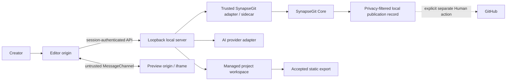
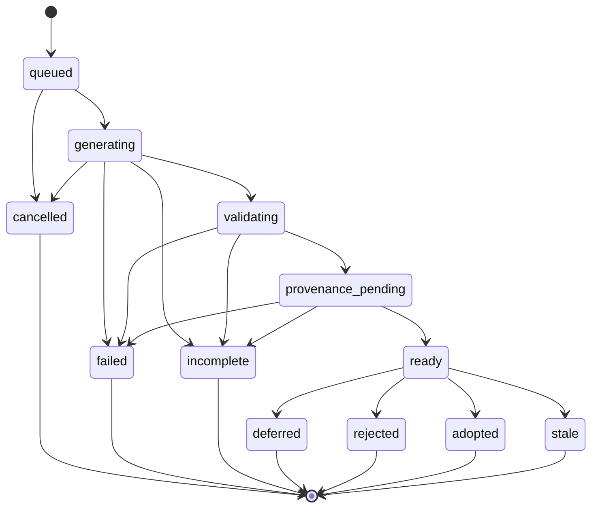

# SynapseGit LP Studio 詳細要件

Status: requirements baseline; includes planned work

Version: 0.1

Last updated: 2026-07-19

Source: [current-specification.md](current-specification.md)

> **重要:** 本書は実装すべき要求の正本です。要件の存在や`MUST`表記は、
> 実装完了を意味しません。現在の完了範囲は
> [実装ステータス](implementation-status.md)と
> [generated traceability](requirements-traceability.md)で確認します。

## 1. 文書の目的

本書は、ブラウザ上のLPプレビューを見ながら、座標、UI要素、テキスト、
空白領域、セクション単位のブロックを指定し、AIとの対話によってローカルの
ランディングページを制作するための実装・試験可能な要件を定義する。

[current-specification.md](current-specification.md) が製品境界と不変原則を
定義し、本書は画面、操作、データ、状態遷移、セキュリティ、SynapseGit連携、
受入条件を具体化する。本書の推奨値を変更してもよいが、Human Decision、
export分離、preview権限分離、SynapseGit trust boundaryを弱めてはならない。

### 1.1 規範語と優先度

| 表記 | 意味 |
| --- | --- |
| MUST / 必須 | 対象milestoneの完了に不可欠 |
| SHOULD / 推奨 | 原則実装する。見送る場合はADRへ理由と代替策を記録 |
| MAY / 任意 | 将来拡張または利便性向上 |
| P0 | M1 Product MVPの必須要件 |
| P1 | 初期releaseまでに推奨する要件 |
| P2 | MVP後の拡張 |

要件IDは `ARCH`（architecture）、`FR`（機能）、`UX`（操作）、
`DM`（データ）、`API`（local API）、`INT`（外部連携）、
`SEC`（security/privacy）、`NFR`（非機能）、`TEST`（試験）、
`AC`（受入条件）、`DEP`（dependency/gate）、`DEV`（開発運用）、
`RECOMMEND`（推奨）を
接頭辞とする。

## 2. 前提、決定事項、milestone

### 2.1 本書で固定する前提

1. 「ブラウザ上で実行」は、UIとLP previewをブラウザで実行し、
   filesystem、AI credential、export、SynapseGit操作はloopback local serverが
   所有する構成を意味する。完全なbrowser-onlyアプリは対象外とする。
2. 初期版は単一ユーザー、単一端末、loopback-onlyであり、public hosting、
   remote access、同時共同編集を行わない。
3. importしたLPはmanaged workspaceへコピーし、元directoryを直接編集しない。
4. 制作対象はbuild済み静的siteである。実行時server、database、
   framework build、package installを必要とするprojectはMVP対象外とする。
5. AIの出力は常にProposalであり、Accepted revisionを自動変更しない。
6. `adopt` はProposalを変更せず全体採用する。
   partial adoption、`adopted_modified`、Proposalの直接編集はMVP対象外とする。
7. `reject` と `defer` はどちらも1つのProposalに対する終端Decisionとする。
   defer後に再開する場合は、旧Proposalを参照する新しいProposalを作る。
8. static site export、SynapseGit Core archive、
   SynapseGit publication bundleは互いに異なる成果物として扱う。
9. GitHub-ready fileの生成と、Git commit/push/PR等のremote writeは別操作とする。
   M1は前者までを対象とし、後者を自動実行しない。
10. released integration baselineはSynapseGit v0.3.0とする。ただしv0.3.0には
    generic LP file proposal契約が存在しないため、実連携には後述する
    `DEP-SG-001` の解消が必要である。

### 2.2 milestone

| Milestone | 目的 | 完了条件の要約 |
| --- | --- | --- |
| M0 Vertical Slice | architectureと危険な境界を早期検証 | fake AI、local-only adapter、1つのelement指定、Proposal比較、adopt、exportをE2Eで通す。製品MVPとは呼ばない |
| M1 Product MVP | 実利用可能なローカルLP制作 | blank/import、全Target種別、live AI adapter、real SynapseGit generic-file連携、Human Decision、復旧、static export、privacy-filtered publication preview |
| M2 Initial Release | 配布・品質・利便性を強化 | 対応platform追加、asset workflow、複数Target、portable project、追加provider、明示確認付きremote publication adapter等 |

`local-only` または `stub` adapterは開発・CIには使用できるが、SynapseGitによる
admission、verification、publicationを実施したように表示してはならず、M1の
real integration完了条件を満たさない。

## 3. 目的、成功条件、非対象

### 3.1 製品目的

- Creatorが「どこを」「どう変えたいか」を視覚的に指定できる。
- AI提案の対象、内容、差分、結果を確認してから人が判断できる。
- 採用済みLPだけを通常のstatic siteとして取り出せる。
- AI提案とHuman Decisionを復元・説明可能な履歴としてSynapseGitへ記録できる。
- privacy-filteredな記録を人が確認し、SynapseGit実活用事例として共有できる。

### 3.2 成功条件

- blank projectと既存static LPの双方で、選択からexportまでのE2Eが完了する。
- element、text、point、region、block、page targetが明示的に区別される。
- DOM変更後にTargetが一意に解決できない場合、誤った要素へ自動接続しない。
- AI出力や連携障害がAccepted revisionを暗黙または部分的に変更しない。
- 同じAccepted revisionとexport optionから同じfile bytesを得られる。
- exportに会話、Target、credential、preview bridge、SynapseGit内部情報が混入しない。
- SynapseGitが実際に保証した範囲と、単なるAI attributionをUIと記録で区別する。

### 3.3 初期非対象

- public/multi-user hosting、remote LAN access、共同編集
- server-side application、CMS、WordPress、database付きsiteの生成
- arbitrary shell、package install、build command、server codeのAI実行
- autonomous adoption、partial adoption、unreviewed remote publication
- visual design suite全般、汎用IDE、Git clientの完全代替
- screenshotまたは座標だけによるsemantic identityやauthorshipの証明
- AI生成物の正確性、権利、法令適合、コンバージョン成果の保証

## 4. 利用者と主要use case

### 4.1 Persona

| Persona | 主な目的 | 前提 |
| --- | --- | --- |
| Creator | LPを会話と視覚指定で制作・修正する | HTML/CSSの専門知識は必須としない |
| Technical Creator | diff、file、provider、export optionを詳しく確認する | static siteの基礎知識を持つ |
| Evaluator | SynapseGitを用いた提案・判断履歴を検証する | privacy-filtered publication recordだけを閲覧できる |

M1ではCreatorとHuman Decisionの権限主体は同一のローカル利用者とする。

### 4.2 主要use case

| ID | Use case |
| --- | --- |
| UC-01 | blank templateからprojectを作成する |
| UC-02 | 既存のbuild済みstatic LPをコピーimportする |
| UC-03 | desktop/tablet/mobileでAccepted LPを確認する |
| UC-04 | element、text、point、region、block、pageをTargetとして選ぶ |
| UC-05 | Targetに対して相談する、または変更Proposalを生成する |
| UC-06 | Accepted/Proposed renderingとfile diffを比較する |
| UC-07 | Proposalをadopt、reject、deferする |
| UC-08 | stale、失敗、中断、再起動後の処理を安全に復旧する |
| UC-09 | Accepted revisionをstandalone static siteとしてexportする |
| UC-10 | privacy-filtered SynapseGit adoption recordを生成・確認する |

## 5. System boundaryとtrust zone



### 5.1 Trust zone要件

- **ARCH-001 / P0:** Editor originとPreview originを別portまたは別hostで分離する。
- **ARCH-002 / P0:** Preview originにはproject write、AI credential、
  SynapseGit、export等のprivileged API routeを置かない。
- **ARCH-003 / P0:** Browserはopaqueなproject/proposal/target IDだけを扱う。
  repository path、Ref、OID、Actor、Policy、Grant、permit、authority値を
  untrusted requestから選択させない。
- **ARCH-004 / P0:** Local serverはproject routing、path解決、file validation、
  Accepted pointer、credential、AI/SynapseGit adapterを所有する。
- **ARCH-005 / P0:** Preview bridgeから得たDOM、geometry、messageは
  untrusted dataとして扱い、filesystem authorityやDecision authorityに使わない。
- **ARCH-006 / P0:** AI providerとSynapseGitをversioned adapterの背後に置き、
  UI、site model、exporterがprovider/core固有型へ直接依存しない。

## 6. 画面構成と共通UX

### 6.1 画面一覧

| ID | 画面/領域 | 必須内容 |
| --- | --- | --- |
| UI-PRJ | Project home | create、import、open、rename、last opened、disk usage、integration status |
| UI-EDT | Editor | project/revision、viewport、preview、Target、conversation、Proposal status |
| UI-REV | Proposal review | base、Target、render比較、changed files、diff、validation、Decision |
| UI-HIS | History | Accepted revisions、Proposal、Decision、attribution、sync/recovery status |
| UI-EXP | Export | source revision、base path、external URL、validation、destination、receipt |
| UI-PUB | Publication review | 公開予定field/file、redaction、checksum、生成操作、remote writeとの区別 |
| UI-SET | Settings | AI provider、model、network capability、retention、diagnostics |

### 6.2 Editor layout

- **UX-001 / P0:** Headerにproject名、Accepted revision、保存状態、
  SynapseGit capability/status、viewport selector、export actionを表示する。
- **UX-002 / P0:** 中央にPreview canvas、左または折り畳みpanelに
  page/block/DOM tree、右にTarget cardとconversationを配置する。
- **UX-003 / P0:** Proposalがreadyの場合、review drawerまたは専用画面から
  render比較、file diff、validation、Decisionへ到達できる。
- **UX-004 / P0:** Target cardにはkind、page、短いlabel、capture viewport、
  resolution状態（resolved/ambiguous/detached）を表示する。
- **UX-005 / P0:** AI処理中はphase、経過、cancelを表示する。
  retryは同じ実行の上書きではなく新しいattempt/Proposalとして記録する。
- **UX-006 / P0:** errorは「何が失敗したか」「Accepted LPに影響したか」
  「安全に再試行できるか」を平易な文で示す。
- **UX-007 / P1:** panel幅、viewport、最後に開いたproject等のUI preferenceを
  site fileとは別に保存する。

### 6.3 Previewの操作mode

- **UX-010 / P0:** `選択mode` と `操作mode` を明確に切り替える。
- **UX-011 / P0:** 選択modeではlink navigation、form submit、download、
  popup、top navigationを発火させず、hover/click/dragをTarget選択へ使う。
- **UX-012 / P0:** 操作modeではLPのhover、animation、controlを確認できるが、
  editor権限や外部network capabilityを追加しない。
- **UX-013 / P0:** EscapeでTarget解除、breadcrumbで親要素選択、
  block tree/DOM treeでpointerを使わずTarget選択できる。
- **UX-014 / P0:** desktop、tablet、mobile presetと任意のCSS pixel幅を
  選択できる。preset値は設定としてversion化する。
- **UX-015 / P0:** AcceptedとProposedの表示元を常に明示し、
  切替または横並びで比較できる。両者を誤認させない。
- **UX-016 / P1:** scroll位置と選択Targetを可能な範囲でAccepted/Proposed間に
  同期する。同期不能時は理由を表示する。

## 7. Project、import、local storage

### 7.1 Project lifecycle

- **FR-PROJ-001 / P0:** minimal `index.html` を持つblank projectを作成する。
- **FR-PROJ-002 / P0:** build済みstatic site directoryをmanaged workspaceへ
  copy importする。元directoryは変更しない。
- **FR-PROJ-003 / P0:** projectはapplication-generated opaque IDで登録し、
  display nameのrenameでIDやfilesystem rootを変更しない。
- **FR-PROJ-004 / P0:** browserから任意のserver filesystem pathを渡すだけの
  import APIを提供しない。directory pickerによるbounded file set、
  archive upload、または起動時に登録したrootを使う。
- **FR-PROJ-005 / P0:** import前にfile一覧、総byte数、除外file、warning、
  entry point候補をpreviewし、Human confirmation後にcopyする。
- **FR-PROJ-006 / P0:** `index.html` をprimary entry pointとする。
  relative navigationのmulti-page siteは表示できるが、専用multi-page編集はP2とする。
- **FR-PROJ-007 / P0:** rename/delete/clear history等のdestructive操作は
  対象と影響を表示し、明示確認を要求する。
- **FR-PROJ-008 / P1:** disk使用量とproposal/revision別内訳を表示する。

### 7.2 Logical directory

```text
project/
  site/                         # current Accepted revision
  .studio/                      # never exported
    project.json
    accepted.json               # atomic Accepted pointer
    conversation/
    annotations/
    revisions/
    proposals/
    operations/                 # journal/outbox/recovery state
    exports/
```

物理配置とdeduplication方式は実装選択とするが、この論理分離を維持する。

### 7.3 File boundary

- **FR-FILE-001 / P0:** regular fileとdirectoryのみを受け付ける。
  symlink、hardlink aliasの危険な再利用、device、FIFO、socketを拒否する。
- **FR-FILE-002 / P0:** `.studio`、nested `.git`、credential file、
  OS metadataをsite import対象外とし、除外結果を表示する。
- **FR-FILE-003 / P0:** 全pathをNFCへ正規化し、absolute path、空segment、
  `.`、`..`、NUL、separator混在、case-fold collision、
  Windows予約名を拒否する。
- **FR-FILE-004 / P0:** file count、total bytes、single-file bytes、
  path length、DOM node数に有限の上限を設ける。
- **FR-FILE-005 / P0:** 上限値はserver-owned configとし、UIは現在値と
  limit超過対象を表示する。AI requestから上限を緩和できない。
- **FR-FILE-006 / P0:** site root外へ解決されるpathをread/write/exportしない。
  validationからopenまでのpath replacement raceを可能な範囲で防ぐ。
- **FR-FILE-007 / P0:** `.studio` とsecret patternをsite側に作成する
  AI operationを拒否する。
- **FR-FILE-008 / P0:** archive importはexpanded file count/bytes、
  compression ratio、path depth、entry sizeを展開中に検査する。
  nested archiveを再帰展開せず、zip bomb/duplicate entry/path traversalを拒否する。

推奨初期defaultはimport 1,000 files、総量200 MiB、単一file 20 MiB、
AI変更20 operations、変更text総量5 MiBとする。値はADRでfixture計測後に確定する。

### 7.4 Revision

- **DM-REV-001 / P0:** Accepted revisionはimmutable file manifestとして保存し、
  opaque `revisionId` とcanonical manifestのSHA-256を持つ。
- **DM-REV-002 / P0:** manifestはNFC relative pathのbyte順、media type、
  byte length、file SHA-256を決定的に記録し、mtimeをidentityへ含めない。
- **DM-REV-003 / P0:** `site/` はAccepted pointerが指すrevisionのmaterialized viewとする。
- **DM-REV-004 / P0:** proposal開始、Decision、export前にAccepted manifestを再検証する。
- **DM-REV-005 / P0:** 外部processによる変更を検出した場合、AI outputとして扱わず、
  `external changes detected` として停止する。
- **DM-REV-006 / P1:** 外部変更を取り込む場合はdiff確認後に
  human-authored revisionとして新規記録し、既存Accepted historyを書き換えない。
- **DM-REV-007 / P1:** 過去revisionへ戻す操作はpointerの履歴改変ではなく、
  Human-approved revert Proposal/revisionとして記録する。

## 8. Preview runtimeとisolation

### 8.1 Serving

- **FR-PREV-001 / P0:** AcceptedとProposal workspaceを専用static preview serverから
  project/revision scoped URLで配信する。
- **FR-PREV-002 / P0:** Preview responseにselection bridgeを一時注入できるが、
  source workspace、revision manifest、exportへ保存しない。
- **FR-PREV-003 / P0:** Preview originにeditor session secret、AI credential、
  OS path、SynapseGit handle/OID/Refを渡さない。
- **FR-PREV-004 / P0:** Editor session secretはcookieへ依存せず、
  editor JS memoryからprivileged APIへAuthorization header等で明示送信する。
  localhost cookieはport分離されない点を考慮する。
- **FR-PREV-005 / P0:** Preview URLはopaque project/revision tokenを使い、
  directory traversalや他project enumerationを許さない。

### 8.2 Iframe、CSP、network

- **SEC-PREV-001 / P0:** Preview iframeはEditorと異なるoriginで実行する。
- **SEC-PREV-002 / P0:** sandboxはtop navigation、popup、download、
  form submissionを許可しない。script互換性のため
  `allow-scripts allow-same-origin` を使う場合も、Editorと同一originでは
  絶対に併用しない。
- **SEC-PREV-003 / P0:** default CSPでexternal networkを遮断し、
  少なくとも `connect-src 'none'`、`form-action 'none'` を適用する。
  image/font/style/scriptのexternal host許可はproject capabilityとして個別に確認する。
- **SEC-PREV-004 / P0:** Service Worker登録を無効化または隔離し、
  projectをまたいだ永続controlを防ぐ。
- **SEC-PREV-005 / P0:** Editorは `frame-ancestors 'none'` とし、
  PreviewからEditor DOMへ到達できない。
- **SEC-PREV-006 / P0:** Preview bridge通信はexpected origin、
  `event.source`、MessageChannel/schema/versionを検証する。
  page scriptによるmessage偽装は可能と仮定する。
- **SEC-PREV-007 / P0:** 外部assetを許可した場合、host一覧、送信され得る情報、
  offline非対応をUIとexport reportに表示する。
- **SEC-PREV-008 / P0:** PreviewのlocalStorage、IndexedDB、Cache Storage、
  BroadcastChannel、`window.name` 等をproject/session間で共有しない。
  M1はactive preview sessionごとのephemeral origin、または同等の
  storage partition/clearを使い、project switch/restart testで検証する。

### 8.3 Navigationとcompatibility

- **FR-PREV-010 / P0:** relative navigationは同一project内のbounded pageへ限定する。
- **FR-PREV-011 / P0:** missing asset、blocked external URL、CSP違反を
  creator向けdiagnosticとして表示する。
- **FR-PREV-012 / P0:** dynamic DOMのsource位置を特定できない場合、
  `source unavailable` と表示し、架空のfile/lineを示さない。
- **FR-PREV-013 / P1:** project script errorをsite errorとして隔離し、
  Editor application自体を停止させない。

## 9. Target、座標、block

### 9.1 Target kind

`Target.kind` は次を持つ。

| Kind | 意味 | 主なanchor |
| --- | --- | --- |
| `page` | page全体への依頼 | page path、revision |
| `block` | header/hero/section/CTA/footer等のまとまり | block root element、semantic/heuristic情報 |
| `element` | button、image、heading等のDOM element | element anchor、geometry |
| `text` | element内の文字列range | element anchor、quote/prefix/suffix |
| `point` | blankを含む1点 | document/viewport coordinate、包含block |
| `region` | dragで指定した矩形 | rect、包含block、前後element |

- **FR-TGT-001 / P0:** M1で全6 kindを作成、表示、persist、AI context化する。
- **FR-TGT-002 / P0:** 1 requestは1つのprimary Targetを持つ。
  Targetなしのpage-wide requestは明示的に `page` Targetへ正規化する。
- **FR-TGT-003 / P1:** 複数のreference Targetを追加できる。
  primary/referenceの役割を区別する。
- **FR-TGT-004 / P0:** Proposed previewから取得したTargetを次のrequestに使う場合、
  source Proposalを `derivedFromProposalId` で束縛し、AI ChangeSetのbaseは
  current Accepted revisionのままとする。source Proposalがstaleまたは
  base不一致なら送信せず、再選択/再生成を要求する。

### 9.2 Target v1 data contract

```ts
type TargetKind = "page" | "block" | "element" | "text" | "point" | "region";

interface TargetV1 {
  schemaVersion: 1;
  targetId: string;
  captureRevisionId: string;
  captureSource: "accepted" | "proposal";
  captureProposalId?: string;
  pagePath: string;
  kind: TargetKind;
  label: string;
  viewport: {
    cssWidth: number;
    cssHeight: number;
    scrollX: number;
    scrollY: number;
    devicePixelRatio: number;
    visualViewportScale: number;
    previewScale: number;
  };
  document: {
    cssWidth: number;
    cssHeight: number;
    layoutEpoch: number;
  };
  geometry?: {
    documentCssPixelRect: Rect;
    viewportCssPixelRect: Rect;
    viewportNormalizedRect: Rect;
  };
  point?: {
    documentCssPixel: Point;
    viewportNormalized: Point;
  };
  elementAnchor?: ElementAnchorV1;
  textAnchor?: {
    exact: string;
    prefix?: string;
    suffix?: string;
    startOffset?: number;
    endOffset?: number;
  };
  regionAnchor?: {
    containingBlock?: ElementAnchorV1;
    previousVisibleSibling?: ElementAnchorV1;
    nextVisibleSibling?: ElementAnchorV1;
    layoutMode: "flow" | "flex" | "grid" | "positioned" | "unknown";
  };
  block?: {
    source: "semantic" | "landmark" | "heuristic" | "user";
    level: number;
  };
}

interface ElementAnchorV1 {
  tagName: string;
  uniqueElementId?: string;
  role?: string;
  accessibleName?: string;
  domPath?: string;
  classTokens?: string[];
  ancestorFingerprint?: string;
  siblingIndex?: number;
  runtimeNodeHandle?: string;
}
```

- **DM-TGT-001 / P0:** `targetId` はapplication-generated opaque IDとする。
- **DM-TGT-002 / P0:** `runtimeNodeHandle` は1回のpreview rendering内だけで有効とし、
  persistent identityやauthorityにしない。disk、AI context、SynapseGit、
  publicationへ保存・送信しない。
- **DM-TGT-003 / P0:** text quoteとaccessible nameには長さ上限を設け、
  AI送信前とprovenance書込み前にそれぞれallow-list/redactionを適用する。
- **DM-TGT-004 / P0:** schemaとresolver algorithmを別々にversion化する。
- **DM-TGT-005 / P0:** Targetはcapture revisionへ束縛し、
  Accepted/Proposedのどちらから取得したかを記録する。
- **DM-TGT-006 / P0:** runtime schemaはkind別の必須fieldを検証する。
  `page` はpage/revision、`block`/`element` はelement anchor、
  `text` はelement/text anchor、`point` はpointと包含context、
  `region` はnon-zero geometryとregion anchorを必須とする。
- **DM-TGT-007 / P0:** text `startOffset`/`endOffset` は
  single DOM Text node内のUTF-16 code unit offsetとする。
  複数nodeにまたがるselectionではoffsetをauthorityにせず、
  exact/prefix/suffixとboundary anchorで再解決する。

### 9.3 Coordinate system

- **FR-COORD-001 / P0:** 全geometryはrendering時のCSS pixelを基準とする。
  `documentCssPixelRect` はdocument content原点、`viewportCssPixelRect` は
  visible iframe viewport原点とする。
- **FR-COORD-002 / P0:** `viewportNormalizedRect` は
  `viewportCssPixelRect` とviewportのintersectionをcapture時の
  viewport width/heightで0..1に正規化したvisible rectとする。
  画面外を含むunclipped boxは `viewportCssPixelRect` と
  `documentCssPixelRect` に保持する。
- **FR-COORD-003 / P0:** scroll、DPR、visual viewport scale、
  Editor上のpreview scaleを同時に保存する。DPRやzoomをelement identityにしない。
- **FR-COORD-004 / P0:** transformed elementのrectは
  `getBoundingClientRect()` 相当のaxis-aligned bounding boxとして扱う。
- **FR-COORD-005 / P0:** point/regionはpreview境界へclampし、
  regionにはkeyboard代替と最小sizeを設ける。
- **FR-COORD-006 / P0:** 座標は候補解決と意図説明の補助であり、
  座標だけでrevisionをまたいで別elementへ自動接続しない。
- **FR-COORD-007 / P0:** 空白領域では中心と四隅のhit test、包含block、
  前後のvisible sibling、layout modeを取得する。
- **UX-COORD-001 / P0:** 「空白の座標」は厳密なDOM挿入位置ではなく
  visual hintであることをUIに表示する。AIにはabsolute positioningを優先させず、
  container/siblingに対するsemantic insertionとして渡す。

### 9.4 Block selection

- **FR-BLOCK-001 / P0:** `header`、`nav`、`main`、`section`、
  `article`、`aside`、`footer`、landmark role、
  body/mainのvisible直下elementをblock候補にする。
- **FR-BLOCK-002 / P0:** heuristic候補はmin visible size、nesting depth、
  computed displayを用いて過剰な候補を抑える。
- **FR-BLOCK-003 / P0:** Canvasとblock treeから同じTarget契約を生成する。
- **FR-BLOCK-004 / P0:** LP Studio専用IDをsite sourceへ自動永続化しない。
  bridgeによる一時annotationは許可するがexportしない。
- **FR-BLOCK-005 / P0:** Creatorはbreadcrumb/parent-child操作で
  elementとblockの粒度を切り替えられる。
- **FR-BLOCK-006 / P1:** user-defined block labelを `.studio` に保存できる。

### 9.5 Re-resolution

- **FR-RESOLVE-001 / P0:** Target解決結果を
  `resolved`、`ambiguous`、`detached` で返す。
- **FR-RESOLVE-002 / P0:** unique ID、semantic fingerprint、
  text quote、ancestor/sibling関係、DOM path、geometryの複数signalを使う。
- **FR-RESOLVE-003 / P0:** geometry単独、class単独、text単独で
  revisionをまたぐauto bindingを行わない。
- **FR-RESOLVE-004 / P0:** ambiguous時は上位候補をoverlayとlistで表示し、
  Creatorが選び直すまでAI変更生成を停止する。
- **FR-RESOLVE-005 / P0:** detached時は元のquote/thumbnail-free summary/位置を
  表示し、再選択またはpage-wideへの変更を促す。
- **FR-RESOLVE-006 / P0:** resolver scoreとcandidate reasonをdiagnosticに残す。
  UIへ誤解を招く過度な精度表示はしない。
- **FR-RESOLVE-007 / P0:** 推奨初期thresholdはscore 0.85以上かつ
  次点との差0.15以上をauto resolved、0.55未満をdetachedとする。
  thresholdはfixtureで検証しresolver versionと共にADRで確定する。

## 10. ConversationとAI context

### 10.1 Conversation

- **FR-CONV-001 / P0:** project-wide conversationとProposal-specific messageを
  区別して保存する。
- **FR-CONV-002 / P0:** message modeを `相談` と `変更案を作成` に分ける。
  相談だけでfile Proposalを生成・採用しない。
- **FR-CONV-003 / P0:** requestには本文、primary Target、base revision、
  provider/model、context manifest、attempt IDを束縛する。
- **FR-CONV-004 / P0:** streaming text、cancel、timeout、provider errorを
  Proposal stateと分離して表示する。
- **FR-CONV-005 / P0:** cancel後にprovider処理が完了しても、
  responseを自動Proposal/adoptしない。
- **FR-CONV-006 / P0:** conversation autosaveはAccepted revisionを変更しない。
- **FR-CONV-007 / P1:** branchした依頼や旧Proposalからの再生成を
  `derivedFromProposalId` で表示する。

### 10.2 Context assembly

- **FR-CTX-001 / P0:** AI requestにはuser request、Target v1、
  relevant DOM、bounded ancestor/sibling、relevant CSS、
  viewport、base revision、必要なfile snippetだけを含める。
- **FR-CTX-002 / P0:** page-wide requestでも送信file/contextに明示上限を設ける。
- **FR-CTX-003 / P0:** context manifestにfile/path、範囲、byte/token概算、
  redaction、画像有無を表示し、送信前にCreatorが確認できる。
- **FR-CTX-004 / P0:** `.studio`、credential、environment variable、
  local absolute path、raw Synapse authority、他project dataを含めない。
- **FR-CTX-005 / P0:** imported HTML内の命令文をuntrusted quoted contentとして
  境界づけ、system/developer instructionとして扱わせない。
- **FR-CTX-006 / P0:** computed styleはbounded allowlistとし、
  全property/全DOMを無制限に送信しない。
- **FR-CTX-007 / P1:** vision対応providerへTarget周辺screenshotを送る場合、
  default off、毎回またはproject単位の明示opt-in、crop preview、redactionを要求する。
- **FR-CTX-008 / P0:** external provider使用時は「UIとfileはlocalだが、
  選択contextはproviderへ送信される」ことを明示する。
- **FR-CTX-009 / P0:** 送信確認ではmanifestだけでなく、providerへ送る
  redacted text/snippetとscreenshotのexact bytesを展開確認できる。
  確認後にcontextが変わった場合はdigest mismatchとして再確認する。

## 11. AI providerとchange protocol

### 11.1 Provider adapter

- **INT-AI-001 / P0:** provider adapterはcapability、model identity、
  request、stream event、structured result、usage、error、cancelをversion化する。
- **INT-AI-002 / P0:** credentialをserver-side environment、
  OS credential store等に保存し、browser、project、log、exportへ渡さない。
- **INT-AI-003 / P0:** model resultへprovider request ID、provider、
  requested/reported model、adapter version、base revisionを記録する。
- **INT-AI-004 / P0:** modelへarbitrary filesystem、shell、
  unrestricted HTTP fetchを与えない。
- **INT-AI-005 / P0:** deterministic fake adapterを同じinterfaceで実装し、
  ordinary CIでlive providerを必要としない。
- **INT-AI-006 / P1:** providerがusage/costを返す場合、見積りと実績を表示する。
  返さない値を推測して確定値として表示しない。
- **INT-AI-007 / P0:** M1では少なくとも1つのlive provider adapterを
  version pinされたcontractで実装する。credentialなしのCIはfake、
  secret-gated manual/contract testはlive adapterを検証する。

### 11.2 Change protocol v1

MVPは構造patchではなく、precondition付きfull text replacementを採用する。

```json
{
  "schema": "org.synapsegit-lp-studio.change-set",
  "version": 1,
  "baseRevisionId": "rev_opaque",
  "summary": "ヒーロー見出しとCTAを更新",
  "operations": [
    {
      "op": "replace_text",
      "path": "index.html",
      "expectedSha256": "sha256-hex",
      "mediaType": "text/html",
      "content": "<!doctype html>..."
    },
    {
      "op": "create_text",
      "path": "styles/hero.css",
      "mediaType": "text/css",
      "content": "..."
    }
  ]
}
```

v1 operationは次に限定する。

| Operation | 必須field / precondition |
| --- | --- |
| `create_text` | `path`、`mediaType`、`content`; destinationが存在しない |
| `replace_text` | `path`、`expectedSha256`、`mediaType`、`content`; hashがbase fileと一致 |
| `rename` | `from`、`to`、`expectedSha256`; source hash一致、destination不存在 |
| `delete` | `path`、`expectedSha256`; source hash一致、entry pointを失わない |

- **FR-CHG-001 / P0:** schema/version/unknown operation/required fieldを検証する。
- **FR-CHG-002 / P0:** path、extension/media type、operation count、
  per-file/total bytes、UTF-8 validityを検証する。
- **FR-CHG-003 / P0:** replace/rename/deleteにはexact file hashを要求する。
- **FR-CHG-004 / P0:** operation間のsource/destination collision、
  rename cycle、duplicate path、case-fold collisionを拒否する。
- **FR-CHG-005 / P0:** 全operationをisolated Proposal workspaceへ
  1 transactionとして適用し、1件でも失敗したらreadyにしない。
- **FR-CHG-006 / P0:** `index.html` を削除または到達不能にするChangeSetを拒否する。
- **FR-CHG-007 / P0:** v1ではLLMによるbinary/base64 asset生成を受け付けない。
  binary assetは将来のbounded asset adapterへ分離する。
- **FR-CHG-008 / P0:** HTML/CSS/JS等のparse可能性、local reference、
  entry point、export deny-listを順に検査する。
- **FR-CHG-009 / P0:** parser warningと安全上のhard errorを区別し、
  hard error時はAccepted revisionを1 byteも変更しない。
- **FR-CHG-010 / P0:** invalid model resultのraw contentをsiteへ書かない。
  redacted diagnosticとvalidation errorだけを保存する。
- **FR-CHG-011 / P0:** Proposalが新しいexternal origin、form action、
  script、iframe、download、analytics/cookie behaviorを導入する場合、
  reviewをblockするP0 warningとしてexact diffとdestinationを表示する。

### 11.3 Validation order

1. response envelopeとprotocol schema
2. base revision一致
3. path/media type/size/operation graph
4. file hash precondition
5. isolated workspaceへの適用
6. static syntax、entry point、local reference、deny-list
7. sandboxed Proposed preview
8. Target re-resolutionとreview artifact生成
9. SynapseGit proposal registration
10. `ready` への遷移

step 1から9のどこで失敗してもAccepted revisionを変更しない。

## 12. Proposal reviewとHuman Decision

### 12.1 Proposal state



- **DM-PROP-001 / P0:** Proposalはopaque ID、base revision、request/Target、
  ChangeSet、workspace manifest、attempt、attribution、validation、
  Synapse receipt、statusを持つ。
- **DM-PROP-002 / P0:** `adopted`、`rejected`、`deferred` は終端とし、
 同じProposalへの二度目のDecisionを拒否する。
- **DM-PROP-003 / P0:** `stale` はbaseと現在のAccepted revisionが
  一致しなくなった状態とし、adoptを許可しない。
- **DM-PROP-004 / P0:** stale Proposalを暗黙rebaseしない。
  最新baseから新Proposalを生成し、`derivedFromProposalId` を記録する。
- **DM-PROP-005 / P0:** interrupted generation/validationは
  `incomplete` または `failed` として復旧し、`ready` やAcceptedにしない。
- **DM-PROP-006 / P0:** 複数ready Proposalを許容する場合も、
  base revisionとproject単位Decision lockで競合を検出する。

### 12.2 Review

- **UX-REV-001 / P0:** review画面にProposal ID、base revision、Target、
  user request、provider/model attribution、changed file一覧、operation種別、
  validation結果を表示する。
- **UX-REV-002 / P0:** text fileにはunifiedまたはside-by-side diffを表示し、
  create/rename/deleteを明確に区別する。
- **UX-REV-003 / P0:** Accepted/Proposed renderingを切り替えまたは並べて表示し、
  現在の表示元を固定labelで示す。
- **UX-REV-004 / P0:** Proposed DOMでTargetを再解決し、
  resolved/ambiguous/detachedと候補を表示する。
- **UX-REV-005 / P0:** warningを無視してもよい項目と、Decisionをblockする
  hard errorを視覚・accessible textの双方で区別する。
- **UX-REV-006 / P0:** Decision buttonの近くに、adoptの変更file数、
  reject/deferでAcceptedが変わらないこと、deferが終端であることを表示する。
- **UX-REV-007 / P1:** HTML accessibility、broken local link、
  external asset、document metadata等のquality reportを併記する。
  自動検査合格を完全な準拠として表示しない。

### 12.3 Decision semantics

- **FR-DEC-001 / P0:** Human Decisionは `adopt`、`reject`、`defer` に限定する。
- **FR-DEC-002 / P0:** `adopt` はSynapseGitの
  `adopted_unchanged` に対応し、Proposal manifestを変更せずAcceptedにする。
- **FR-DEC-003 / P0:** `reject` と `defer` はAccepted revisionを維持する。
- **FR-DEC-004 / P0:** deferした内容を再開する操作は、
  最新Accepted baseの新Proposalを作成し、旧Proposalとの関連を記録する。
- **FR-DEC-005 / P0:** Proposal fileの手修正、file単位採用、
  hunk単位採用を提供しない。修正要求は新しいProposalにする。
- **FR-DEC-006 / P0:** BrowserからDecision APIへ渡せるauthority inputは
  `proposalId`、`expectedAcceptedRevisionId`、disposition、
  bounded rationale、idempotency keyに限定する。
- **FR-DEC-007 / P0:** Ref、head、OID、Actor、Policy、Grant、
  candidate Commitをbrowserに構築・選択させない。
- **FR-DEC-008 / P0:** project単位でDecisionを直列化し、
  expected Accepted mismatchを `stale_proposal` としてfail closedにする。
- **FR-DEC-009 / P0:** rationaleはprivateをdefaultとし、
  publication用noteは別fieldへ明示入力する。

### 12.4 Adopt recovery saga

Local Accepted pointerとSynapseGit Decisionは単一transactionにできないため、
次の順序と復旧契約を必須とする。

1. immutable Proposal workspaceとmanifestを完成・再検証する。
2. local operation journalへDecision intentとidempotency keyをdurableに保存する。
3. ready時に保存済みのProposal receiptをpreconditionとして、
   SynapseGit Decisionだけをversioned adapter経由で冪等に記録し、
   Decision receiptを保存する。
4. Synapse receiptがadoptを示す場合だけ、Accepted pointerをatomicに切り替える。
5. materialized `site/`、local history、operation statusを整合させて完了する。

- **FR-REC-001 / P0:** step 3より前の失敗ではAccepted pointerを変更しない。
- **FR-REC-002 / P0:** step 3成功後、step 4前にcrashした場合、起動時にreceiptと
  immutable manifestからAccepted pointer切替を完了できる。
- **FR-REC-003 / P0:** `reject`/`defer` もDecision receiptからlocal終端状態を
  冪等に再構築できる。
- **FR-REC-004 / P0:** outcome unknown、permit burn、timeout時にblind retryせず、
  adapterのquery/reconciliationでDecision有無を確認する。
- **FR-REC-005 / P0:** 同じidempotency keyで二重Decision、
  二重Accepted revision、二重reflogを作らない。
- **FR-REC-006 / P0:** disk full、process kill、adapter restartを各stepで試験する。

## 13. SynapseGit integration

### 13.1 Current baselineと禁止する前提

SynapseGit v0.3.0で利用できるCore要素はBlob、ManifestTree、Commit、
Ref CAS/reflog、Creative AI proposal、narrow Human Decision、
archive、Creator Pilot向けpublicationである。一方、次は未実装である。

- generic static-site file treeのproposal API/CLI
- DOM/viewport/blockを表すLP-specific Target contract
- restart後にpending Human reviewを再開するdurable handle/receipt
- LP historyを入力にするprovider-neutral publication projection
- generic CLIのcheckout、diff、publish-proposal、publish-decision、JSON output

既存localhost APIはoriginal/current/caller-supplied AI outputの3画像を扱う
Creator Pilot専用であり、別originのLP Studio browserから直接利用する契約ではない。

- **INT-SG-001 / P0:** Browserから `synapse-local`、raw Core CLI、
  `refs.sqlite3`、CAS、`Repository::update_ref` へ直接接続しない。
- **INT-SG-002 / P0:** LP Studio local serverからversioned
  `synapsegit-adapter` とtrusted use-case API/sidecarだけを呼ぶ。
- **INT-SG-003 / P0:** 起動時にapp/CLI contract、Core schema、OID profile、
  generic-file proposal、Human Decision、durable recovery、publication capabilityを
  negotiationし、unsupported combinationはfail closedにする。
- **INT-SG-004 / P0:** exact supported version範囲をpinし、
  untagged sibling repositoryの機能を暗黙利用しない。
- **INT-SG-005 / P0:** SynapseGit repository writeはproject単位で直列化し、
  adapterがshared interprocess lockを取得できる場合は使用する。
  v0.3 CLI等の非協調writerも想定し、operation前後のRef snapshot/digestと
  final CASでconcurrent changeを検出し、保証できない場合はfail closedにする。
  UIは同repositoryへの外部CLI同時writeを行わないよう警告する。

### 13.2 Required dependency: generic LP contract

**DEP-SG-001 / M1 blocker:** 次のいずれかを実装・review・version化する。

1. SynapseGit側にgeneric-file Proposal/Human Decision use-case contractを追加する。
2. LP Studio側のtrusted Rust sidecarがexact pinned SynapseGit cratesをembedし、
   同等のcontractを提供する。

どちらの場合も次を満たす。

- static site file treeを決定的にBlob/ManifestTreeへ変換する。
- initial canonical Decision Ref、Actor、Policy、Grant、ContextPack、
  initial Tree/Commitをtrusted bootstrapする。
- AI requestからRef/OID/authorityを選ばせない。
- Proposal admission、stale base、Ref conflict、Human Decisionを保持する。
- `adopted_unchanged`、`rejected`、`deferred` のみをMVPで許可する。
- Proposal/Decision receiptとoutcome queryをdurableかつidempotentにする。
- process restart後のreview/reconciliationを安全に行える。
- error codeをretryable、terminal、outcome-unknownへ分類する。
- raw low-level Ref mutationをuntrusted routeとして公開しない。

M0のstub/local ledgerはこの依存を満たさない。

### 13.3 Site-to-Core mapping

| LP Studio | SynapseGit mapping | 備考 |
| --- | --- | --- |
| regular file bytes | Blob | path、mtime、MIMEをBlob identityに混同しない |
| normalized directory | nested ManifestTree | NFC relative name、決定的ordering |
| Accepted/Proposal revision | Commit + snapshot Tree | LP revision IDとTree/Commit OIDを別々に保持 |
| AI operation | Activity/ContextPack/Proposal Commit | base、output、capabilityをtrusted adapterが構築 |
| redacted ProvenanceTarget projection | canonical JSON Blob + SpatialRegion `data_ref` 等 | local full Targetをそのままimmutable保存しない |
| Human Decision | DecisionFeedback + Decision Commit | one disposition per Proposal |
| Accepted lineage | canonical `decision/*` Ref | exact namingはcontract ADRで決定 |

- **INT-SG-MAP-001 / P0:** mapperはregular fileだけを扱い、symlink/deviceを拒否する。
- **INT-SG-MAP-002 / P0:** path normalization、ordering、byte identity、
  size limitをgolden fixtureで固定する。
- **INT-SG-MAP-003 / P0:** LP `revisionId` とSynapse Tree/Commit OIDを
  同一identifierとして扱わず、binding recordを保持する。
- **INT-SG-MAP-004 / P0:** local full Targetから別schemaの
  `ProvenanceTarget` をfield allow-list、length bound、secret redaction、
  Creator reviewによって生成し、そのcanonical JSON OIDだけを記録する。
  SynapseGit CoreがDOM再解決を検証したとは主張しない。
- **INT-SG-MAP-005 / P0:** full prompt、raw provider response、credential、
  private rationaleをCore/publicationへ保存しない。redacted request summary、
  digest、Target OID、provider/model attribution、protocol versionを保存する。
- **INT-SG-MAP-006 / P0:** ProvenanceTargetにはraw text quote、
  accessible name、class token、runtime handleをdefaultで含めず、
  kind、pageのpublic-safe label、coarse/normalized scope、schema version、
  local Target digest等のreview済みfieldだけを許可する。

### 13.4 Attributionとclaim

- **INT-SG-CLAIM-001 / P0:** 外部providerをLP local serverが呼び、
  生成済みbytesをSynapse adapterへ渡すだけの場合は
  `AI-attributed` / `caller-supplied` と表示する。
- **INT-SG-CLAIM-002 / P0:** trusted SynapseGit `AiExecutor` 境界内で
  model executionまで実施・receipt化した場合だけ、
  supported scopeのverified execution claimを表示できる。
- **INT-SG-CLAIM-003 / P0:** byte/graph identityからauthorship、truth、
  rights、permission、semantic/visual correctness、physical changeを推論しない。
- **INT-SG-CLAIM-004 / P0:** UIとpublication recordで
  `verified_from_synapse`、`observed_from_synapse`、
  `derived_summary`、`author_supplied` を区別する。

### 13.5 Availabilityとfailure

- **INT-SG-AVAIL-001 / P0:** integration modeを
  `real`、`local-only test`、`unavailable` として常時表示する。
- **INT-SG-AVAIL-002 / P0:** real integration projectでは
  Synapse proposal registration未完了のProposalをadoptできない。
- **INT-SG-AVAIL-003 / P0:** SynapseGit障害中もAccepted preview、
  conversation draft、history閲覧、last verified Accepted static exportは可能とする。
  new Decision、未同期revisionのexport、Synapse-backed publicationは停止する。
- **INT-SG-AVAIL-004 / P0:** integration failureでAccepted fileを破損せず、
  recovery actionとlast verified stateを表示する。
- **INT-SG-AVAIL-005 / P0:** `stale_base`、`ref_conflict`、
  `execution_permit_invalid`、`outcome_unknown` を別々に扱う。

### 13.6 SynapseGit feedback / Issue運用

LP StudioでSynapseGitの不足、不便、理解しづらさ、回避策、性能問題、
errorの不明瞭さが見つかった場合、LP Studio内だけの恒久workaroundで
隠さず、SynapseGit repositoryへ積極的にfeedbackする。

- **INT-SG-FB-001 / P0:** SynapseGit起因のblocker、repeated workaround、
  missing capability、ambiguous contractを `SynapseGitFeedbackCandidate` として記録する。
- **INT-SG-FB-002 / P0:** 起票前にSynapseGitのopen/closed Issue、
  current release note、mainのcontractを検索し、重複時は既存Issueへ
  追加evidenceを提供する。
- **INT-SG-FB-003 / P0:** 新規Issueは1 concernに限定し、
  version/commit、最小再現、expected/actual、LP Studioへの影響、
  security/privacy考慮、具体的受入条件を含める。
- **INT-SG-FB-004 / P0:** credential、private prompt、raw customer LP、
  absolute local path、personal data、internal authorityをIssueへ含めない。
- **INT-SG-FB-005 / P0:** Issue本文をHumanがreviewしてからGitHubへ送信し、
  local task/ADRとIssue URLを相互linkする。
- **INT-SG-FB-006 / P0:** workaroundを採用する場合も、Issue status、
  removal condition、compatibility testを記録する。
- **INT-SG-FB-007 / P1:** release/iteration reviewでfeedback候補を棚卸しし、
  未起票のまま放置する場合は理由を記録する。
- **INT-SG-FB-008 / P0:** M1 blockerとなるSynapseGit gapは、
  該当sliceの実装開始前に既存Issueへlink/commentするか、
  独立したIssueを起票する。`candidate` のまま実装を開始しない。

現時点でIssue候補として追跡すべき既知gapは次のとおり。

1. [SynapseGit #22](https://github.com/howlrs/synapsegit/issues/22):
   generic static-site file Proposal/Human Decision contract
2. [SynapseGit #23](https://github.com/howlrs/synapsegit/issues/23):
   process restartをまたぐdurable pending reviewとoutcome query
3. [SynapseGit #24](https://github.com/howlrs/synapsegit/issues/24):
   host-authenticated one-shot Human approval boundary
4. [SynapseGit #26](https://github.com/howlrs/synapsegit/issues/26):
   one projectでのsequential generic artifact Proposal
5. [SynapseGit #27](https://github.com/howlrs/synapsegit/issues/27):
   selected generic site Treeのbounded verified checkout
6. [SynapseGit #17 comment](https://github.com/howlrs/synapsegit/issues/17#issuecomment-5013850363):
   LP-specific provider-neutral publication projection
7. Target v1/SpatialRegionを安全にbindingするextension profile
8. non-cooperative CLIを含むshared writer fencing/outcome detection

実際の起票時はremoteの重複Issueと最新実装を再確認し、必要なら分割する。

### 13.7 License、brand、platform gate

- **DEP-LIC-001 / M2 external-release blocker:** SynapseGit v0.3.0の
  Source-Available LicenseはProduction Useにexternal deliverableを含み、
  production/commercial/hosted use、software/binary redistribution、
  SynapseGit name/logo/trademark利用を一般許諾していない。
  Production利用、binary同梱、外部納品、製品名利用の前に
  Rights Holdersの書面許諾とbrand条件を確認する。
- **DEP-PLAT-001 / P0:** published v0.3.0 binaryはLinux x86_64 GNUがbaselineである。
  他OS/architectureをsupportするときはfixed tag source build、
  packaging、license、reproducibility、E2Eを別途満たす。
- **DEP-LIC-002 / P0:** LP Studio自身、template、font、image、
  AI生成assetのlicense/利用条件を記録し、SynapseGitのlicenseと混同しない。

本項はrepository-local license条件をrelease gateへ反映するものであり、
個別案件の法的助言を提供するものではない。

## 14. Static export

### 14.1 Export sourceとdestination

- **FR-EXP-001 / P0:** export sourceを実行開始時のimmutable
  Accepted revision IDへ固定し、pending/stale Proposalを含めない。
- **FR-EXP-002 / P0:** defaultは新規空directoryまたはdownloadable archiveとする。
  既存destinationへの上書きはfile一覧と影響を表示して別確認を要求する。
- **FR-EXP-003 / P0:** unknown existing fileを自動削除しない。
- **FR-EXP-004 / P0:** staging先で全fileを生成・検証してから、
  destinationをatomicまたはrecoverableな方法で公開する。
- **FR-EXP-005 / P0:** export optionにentry point、base path profile、
  external asset policyを含め、receiptへ記録する。
- **FR-EXP-006 / P0:** directory destinationは起動時に登録したexport root、
  native/user-selected bounded directory handle、またはmanaged export rootに限定する。
  browser supplied arbitrary server pathへ直接writeしない。
- **FR-EXP-007 / P0:** exact destination、existing diff、symlink/no-follow検査、
  overwrite scopeをHuman confirmationへ表示し、確認後のdestination変更を拒否する。

### 14.2 Isolationとvalidation

- **FR-EXP-010 / P0:** Studio-originの `.studio`、conversation、annotation、
  Target、prompt、provider response、credential、local absolute path、
  preview bridge、session token、SynapseGit repository dataを
  allow-listされたsite manifestから構造的に除外する。
  Creator自身のsite contentに同じ一般語が現れただけで拒否しない。
- **FR-EXP-011 / P0:** allow-listされたsite manifestからcopyし、
  deny-listだけに依存しない。
- **FR-EXP-012 / P0:** symlinkとsite root外のresolved fileを拒否する。
- **FR-EXP-013 / P0:** HTML `src/href/srcset`、CSS `url()` 等の
  local referenceを検証し、missing fileをerror/warningとして表示する。
- **FR-EXP-014 / P0:** JavaScriptによるdynamic referenceは完全検査できないため、
  best-effort範囲と未検査項目をreportする。
- **FR-EXP-015 / P0:** external URL一覧を表示し、
  `standalone static` と `offline self-contained` を区別する。
- **FR-EXP-016 / P0:** ordinary static HTTP hostingで実行できることをMVP要件とする。
  ES moduleやfetchを含むsiteの `file://` direct openは保証しない。
- **FR-EXP-017 / P1:** local preview用の権限を持たないstatic server commandを提供する。

### 14.3 Determinismとreceipt

- **NFR-EXP-001 / P0:** 同一Accepted manifestとoptionから同一file bytes、
  canonical manifest entry order、manifest hashを生成する。
  directory enumeration orderとmtimeはidentity対象外とする。
- **NFR-EXP-002 / P0:** ZIPを提供する場合、entry order、timestamp、
  permission、compression optionを固定してdeterministicにする。
- **DM-EXP-001 / P0:** Export receiptはsource revision、option、
  generated file manifest、checksum、warning、time、app versionを
  `.studio` 側へ保存し、siteへ自動混入させない。
- **FR-EXP-018 / P0:** 同じsourceで2回exportしたchecksumを比較できる。

## 15. SynapseGit publicationとGitHub-ready record

### 15.1 成果物の分離

| 成果物 | 目的 | Network write |
| --- | --- | --- |
| LP static export | 実際に配信するLP | なし |
| SynapseGit Core archive | Core authorityのrestore用archive | なし |
| LP publication bundle | privacy-filteredな派生説明 | なし |
| GitHub commit/push/PR | remote共有 | 明示的な別Human action |

- **INT-PUB-001 / P0:** 現行 `synapse-present` の3画像CreatorReportを
  generic LP historyにそのまま使わない。
- **INT-PUB-002 / P0:** LP-specific provider-neutral projection contractを
  version化し、Synapse/GitHub target rendererより前に生成する。
- **INT-PUB-003 / P0:** publication生成はnetwork operationを実行せず、
  local preview stateとする。

### 15.2 Publication content

- **DM-PUB-001 / P0:** schema/generator/app/SynapseGit contract version、
  project public label、Accepted revision binding、Proposal attribution、
  Human disposition、completeness、limitations、checksumsを含める。
- **DM-PUB-002 / P0:** completeとincomplete Proposal/Decisionを区別する。
- **DM-PUB-003 / P0:** raw LP asset、full prompt、raw provider response、
  private rationale、credential、internal Actor ID、repository pathを
  defaultで構造的に除外する。
- **DM-PUB-004 / P0:** public title、summary、decision noteは
  `author_supplied` としてsource factから区別する。
- **DM-PUB-005 / P0:** OID/checksumによるcorrelation risk、
  bundleがsignature/authorship proofではないことをlimitationsへ記載する。
- **DM-PUB-006 / P0:** raw assetまたはthumbnail公開は別opt-in pipelineとし、
  decode isolation、metadata strip、pixel/byte limit、rights確認を要求する。

### 15.3 Reviewとremote write

- **UX-PUB-001 / P0:** file tree、field、redaction、identifier、
  public note、checksum、limitationを送信前と同じbytesでpreviewする。
- **UX-PUB-002 / P0:** `GitHub-ready filesを生成` と
  `GitHubへ公開` を別label/actionにする。
- **INT-PUB-010 / P0:** Git commit、push、Issue、PR、release等のremote writeは
  exact destinationとdiffをHumanが確認した別操作にする。
- **INT-PUB-011 / P0:** static LP exportだけを行い、historyを公開しない選択を許す。
- **INT-PUB-012 / P1:** 将来remote adapterを追加する場合、
  destination、dry-run、destination diff、idempotency key、retry、
  partial outcome、receipt、privacy revalidationをcontract化する。

## 16. Core data model

| Entity | 必須fieldの要約 | Authority |
| --- | --- | --- |
| Project | opaque ID、name、schema、entry point、root handle、limits | Local server |
| Revision | opaque ID、manifest hash、parent、origin、created time | Local site model |
| Target | Target v1、capture revision、resolution | Editor protocol、server validates |
| Message | thread、role、mode、request/response、redaction | Local conversation |
| Proposal | base、Target、ChangeSet、manifest、status、attribution、receipt | Local + Synapse binding |
| Decision | Proposal、disposition、private/public note、receipt | Human via trusted adapter |
| OperationJournal | phase、idempotency、expected state、receipt、recovery | Local server |
| ExportReceipt | revision、option、manifest/checksum、warning | Exporter |
| PublicationDraft | projection version、redaction、files/checksums | Publication adapter |

- **DM-001 / P0:** 全schemaにname/versionを持たせ、unknown major versionを拒否する。
- **DM-002 / P0:** IDはopaqueでunguessableとし、path、DOM label、
  model stringをauthority identifierにしない。
- **DM-003 / P0:** timestampはtrusted local serverがUTCで生成し、
  UIでlocal timezoneへ表示する。
- **DM-004 / P0:** file contentとsensitive conversationをUI state storeへ
  不要に複製しない。
- **DM-005 / P0:** schema migration前にbackup/restore pointを作り、
  failure時にold dataを破損しない。

## 17. Local APIとprotocol boundary

具体的pathは実装ADRで変更できるが、M1では次のuse-case APIをversion化する。

| Method / suggested path | Purpose | 主なprecondition |
| --- | --- | --- |
| `GET /api/v1/session` | capability/session取得 | exact Host/Origin |
| `GET/POST /api/v1/projects` | list/create | authenticated editor session |
| `POST /api/v1/imports` | bounded import | preview済みmanifest、confirmation |
| `GET /api/v1/projects/:id/state` | Accepted/active status | opaque project ID |
| `POST /api/v1/projects/:id/proposals` | AI Proposal開始 | base、Target、idempotency |
| `GET /api/v1/proposals/:id/events` | progress stream | project ownership |
| `GET /api/v1/proposals/:id/review` | diff/validation/preview metadata | ready/terminal |
| `POST /api/v1/proposals/:id/decision` | adopt/reject/defer | expected Accepted、idempotency |
| `POST /api/v1/projects/:id/exports` | Accepted export | exact revision、option |
| `POST /api/v1/projects/:id/publications` | local publication draft | Synapse capability、redaction |
| `POST /api/v1/operations/:id/reconcile` | outcome recovery | server-owned operation state |

- **API-001 / P0:** unsafe APIはsession authentication、exact Host、
  exact Origin、Content-Type、Fetch Metadata、body limitを検証する。
- **API-002 / P0:** CORSをdefault denyとし、Preview originからprivileged APIを
  呼べないようにする。
- **API-003 / P0:** mutationはidempotency keyとexpected stateを持ち、
  duplicate、conflict、outcome unknownを区別する。
- **API-004 / P0:** error envelopeはstable `code`、safe `message`、
  `retryable`、`operationId`、redacted detailを持つ。
- **API-005 / P0:** stack trace、absolute path、credential、
  provider raw response、Synapse internal authorityをpublic errorへ含めない。
- **API-006 / P0:** progress stream切断をoperation cancelと同一視せず、
 再接続時にserver-side statusを取得する。
- **API-007 / P0:** long operationはbounded queue、cancel、
  project-level serializationを持つ。

## 18. Securityとprivacy

### 18.1 Threat model

| Threat source | 想定する攻撃・事故 | 主な防御 |
| --- | --- | --- |
| Imported/AI-generated site | XSS、navigation、network exfiltration、service worker、resource exhaustion | 別Preview origin、sandbox、CSP、limit |
| Malicious web page | loopback APIへのCSRF、DNS rebinding、project enumeration | random secret、exact Host/Origin、no CORS、opaque ID |
| AI/provider result | path traversal、oversized result、prompt injection、destructive operation | schema、hash precondition、isolated workspace、Human review |
| Local filesystem | symlink/path race、external modification、disk full | managed root、safe open、manifest CAS、journal |
| Integration failure | duplicate Decision、unknown outcome、stale adoption | idempotency、receipt query、reconciliation、single writer |
| Accidental publication | prompt/secret/path/rationale leakage | structural omission、redaction、exact-byte review |

同じOS user権限を持つmalicious processからの完全隔離はMVPの保証外とする。
ただし外部変更を検出し、権限を不要に広げず、重要な境界を文書化する。

### 18.2 Loopback application security

- **SEC-APP-001 / P0:** Local serverをIPv4 `127.0.0.1` のrandom portにだけbindし、
  `0.0.0.0`、LAN interface、reverse proxy公開を拒否する。
- **SEC-APP-002 / P0:** 起動ごとに十分なentropyを持つprocess-local session secretを
  生成し、終了時に失効させる。
- **SEC-APP-003 / P0:** 起動URLでsecretを渡す場合はURL fragment等を用い、
  query、Referer、logへ残さない。Editorはsecretをmemoryだけに保持する。
- **SEC-APP-004 / P0:** exact scheme/host/portをallow-listし、
  Host mismatchとunexpected OriginをDNS rebinding/CSRFとして拒否する。
- **SEC-APP-005 / P0:** unsafe methodにJSON等のexpected Content-Type、
  `Sec-Fetch-Site`、body/file count/byte limitを適用する。
- **SEC-APP-006 / P0:** health以外のrouteからproject存在、
  path、integration stateをunauthenticated callerへ開示しない。
- **SEC-APP-007 / P0:** Editor responseにstrict CSP、nosniff、
  referrer policy、frame prohibitionを設定する。
- **SEC-APP-008 / P0:** session/authentication tokenをPreview、AI context、
  diagnostic bundleへ含めない。

### 18.3 Untrusted renderingとcontent

- **SEC-CONT-001 / P0:** AI response、file content、diff、error、rationaleを
  Editor DOMへraw HTMLとして挿入しない。必要なMarkdownはsanitizeする。
- **SEC-CONT-002 / P0:** SVG、HTML、JavaScriptはactive contentとして
  Preview origin内だけで実行し、Editor componentとして直接renderしない。
- **SEC-CONT-003 / P0:** selection bridgeはpage scriptに改変され得るため、
  message dataをtrusted locatorやsource proofとして扱わない。
- **SEC-CONT-004 / P0:** preview resource limit違反、infinite navigation、
  repeated dialog等からEditorへ戻れるkill/reload controlを提供する。
- **SEC-CONT-005 / P1:** dependency、template、generated HTMLへ
  static security scanを実行し、false positiveを含む範囲を説明する。

### 18.4 Filesystem safety

- **SEC-FS-001 / P0:** pathはserver-side registered rootから解決し、
  path componentのsymlink/no-follow policyを適用する。
- **SEC-FS-002 / P0:** validationしたhandleと実際にread/writeする対象の
  identityを可能なplatformで一致させ、check-then-open raceを最小化する。
- **SEC-FS-003 / P0:** temporary fileをcreate-newで作成し、
  flush後にno-replace/atomic publishする。Accepted pointerはatomic writeする。
- **SEC-FS-004 / P0:** permission不足、disk full、partial writeで
  Accepted pointerを進めない。
- **SEC-FS-005 / P0:** cleanupはLP Studioが所有すると証明できるtemporary
  artifactだけを対象にし、unknown fileを削除しない。

### 18.5 Secretとpersonal data

- **SEC-PRIV-001 / P0:** provider credential、session secret、
  environment、private rationale、raw provider responseをdefaultでpersistしない。
- **SEC-PRIV-002 / P0:** conversation/AI context保存前にsecret patternを検査し、
  redactionしたことをCreatorへ表示する。redactionを完全保証とは表現しない。
- **SEC-PRIV-003 / P0:** local logにprompt、file body、credential、
  raw provider responseをdefaultで記録しない。
- **SEC-PRIV-004 / P0:** telemetryはdefault offとし、
  enable時はdestination、field、retention、disable方法にopt-inを要求する。
- **SEC-PRIV-005 / P0:** project/conversation/proposal/publication draftを
  Creatorが削除でき、削除範囲とSynapse immutable historyへの影響を説明する。
- **SEC-PRIV-006 / P0:** external providerのdata retention/training policyは
  adapter metadataとして表示し、不明な場合は不明と示す。
- **SEC-PRIV-007 / P1:** support用diagnostic exportはexact file一覧と
  redacted previewを示し、明示操作でのみ生成する。

## 19. Reliability、consistency、recovery

- **NFR-REL-001 / P0:** metadata autosaveはtemp file + atomic replaceまたは
  transactionを使い、途中byteをvalid stateとして読まない。
- **NFR-REL-002 / P0:** Accepted revision、Proposal、Decision、exportの
  durable state machineをserver側で管理し、browser memoryだけに置かない。
- **NFR-REL-003 / P0:** project単位のwrite operationを直列化し、
  read operationには参照revisionを固定する。
- **NFR-REL-004 / P0:** process起動時にunfinished operationをscanし、
  `safe to resume`、`needs reconciliation`、`failed` を決定する。
- **NFR-REL-005 / P0:** crash後にProposalをAcceptedと推測しない。
  durable Accepted pointerまたはverified Synapse receiptだけを根拠にする。
- **NFR-REL-006 / P0:** provider timeout/cancel後にlate responseを受けても、
  new attemptとして明示採用しない限りProposalへ昇格しない。
- **NFR-REL-007 / P0:** schema migration前にversioned backupを作り、
  migration failureでold projectをread-only recovery可能にする。
- **NFR-REL-008 / P0:** integration/database corruptionを検出した場合、
  automatic repairを行わず、read-only diagnosticsとbackup/export導線を示す。
- **NFR-REL-009 / P1:** manual backup/restoreで `.studio` とsite historyの
  consistencyを検証する。Synapse Core archiveとは別操作であることを示す。
- **NFR-REL-010 / P0:** last Accepted static exportはSynapseGit一時停止中も可能とする。
  ただし未同期DecisionをAcceptedとみなしたexport、publication generationは停止する。

## 20. Performanceとresource limit

### 20.1 Baseline fixture

性能受入に使う標準fixtureをrepositoryへ固定する。推奨初期fixtureは、
500 files、総量50 MiB、10,000 visible/hidden DOM nodes、
responsive breakpoint 3件、CSS transforms、nested scroll containerを含む。

- **NFR-PERF-001 / P0:** hover/selection feedbackをbaseline fixtureで
  p95 100 ms以内に表示する。
- **NFR-PERF-002 / P0:** overlayと実element boxの位置差を
  supported zoom/viewportで2 CSS px以内にする。
- **NFR-PERF-003 / P0:** pointer moveごとに全DOMの
  `getBoundingClientRect()` を計測しない。
- **NFR-PERF-004 / P0:** overlay更新を `requestAnimationFrame` ごとに集約し、
  ResizeObserver、MutationObserver、scrollをlayout epochへ反映する。
- **NFR-PERF-005 / P0:** metadata autosaveを最後の入力から1秒以内、
  write完了p95 1秒以内にする。
- **NFR-PERF-006 / P0:** AI/provider待機を除くChangeSet validationを、
  10 changed text files、総量2 MiBのfixtureでp95 2秒以内にする。
- **NFR-PERF-007 / P0:** operation queue、import、preview、diffに
  memory/CPU/time limitとcancelを設ける。
- **NFR-PERF-008 / P1:** DOM node/stylesheet/file limitへ近づいた場合、
  failure前にCreatorへwarningを表示する。

性能値はCI hardware差を考慮して測定profileを固定し、ADRで調整できる。
調整時もUI freeze、無制限scan、Accepted corruptionを許容しない。

## 21. Accessibility、i18n、compatibility

### 21.1 Studio accessibility

- **NFR-A11Y-001 / P0:** Studio UIはWCAG 2.2 AAを目標とする。
- **NFR-A11Y-002 / P0:** pointerを使わずblock/DOM treeから
  page/block/element/text Targetを選択できる。
- **NFR-A11Y-003 / P0:** point/region指定には、包含blockと前後siblingを
  form/treeから指定するkeyboard代替を提供する。
- **NFR-A11Y-004 / P0:** Target変更、Proposal完了、validation failure、
  stale、Decision完了を適切な `aria-live` で通知する。
- **NFR-A11Y-005 / P0:** overlay、diff、status、warningを色だけで区別しない。
- **NFR-A11Y-006 / P0:** focus visible、logical focus order、landmark、
  accessible nameを持ち、iframeとEditor間でkeyboard trapを作らない。
- **NFR-A11Y-007 / P0:** 200% zoom、320 CSS px幅、reduced motion、
  high contrastで主要flowを完了できる。
- **NFR-A11Y-008 / P0:** generated LPのautomated accessibility reportを
  reviewへ表示するが、tool passを完全なWCAG準拠と表現しない。
- **NFR-A11Y-009 / P1:** screen readerを用いたmanual E2Eをrelease gateに含める。

### 21.2 Language

- **NFR-I18N-001 / P0:** 初期UI言語を日本語とし、user-facing errorを
  technical codeと分離する。
- **NFR-I18N-002 / P1:** message catalogをUI componentから分離し、
  English追加を妨げない。
- **NFR-I18N-003 / P0:** user content、path、Target quoteでUnicodeを保持し、
  normalizationによる表示textの意図しない変更を避ける。

### 21.3 Supported environment

- **NFR-COMP-001 / P0:** supportするOS、architecture、browser/version、
  SynapseGit install方式をreleaseごとに明示する。
- **NFR-COMP-002 / P0:** M0/M1開発baselineはpinned Chromium系browserと
  Linux x86-64 GNU/WSL評価環境とし、他platformを未検証のまま
  supportedと表示しない。
- **NFR-COMP-003 / P0:** browser feature detectionを行い、
  directory picker等がない場合はarchive import等の代替を示す。
- **NFR-COMP-004 / P1:** supported browserごとにiframe sandbox、
  CSS transform、zoom、DPR、text selectionのcontract testを持つ。

## 22. Logging、diagnostics、retention

- **NFR-OBS-001 / P0:** local structured logにoperation/correlation ID、
  safe error code、duration、versionを記録する。
- **NFR-OBS-002 / P0:** log levelを選択でき、default logはprompt/file body/
  credential/provider raw responseを含まない。
- **NFR-OBS-003 / P0:** UIからProposal/Decision/export/publicationの
  local statusとlast errorを追跡できる。
- **NFR-OBS-004 / P0:** SynapseGit adapter logとLP Studio logを
  operation IDで関連づけるが、opaque permitやsecretを共有しない。
- **NFR-OBS-005 / P0:** conversation、failed Proposal、export、
  publication draftのretentionを表示し、manual cleanupを提供する。
- **NFR-OBS-006 / P0:** MVPで自動GCを行う場合は、Accepted revision、
  terminal Decision、recovery中operation、Synapse bindingを削除しない。
  安全性を証明できなければ自動GCを行わない。
- **NFR-OBS-007 / P1:** redacted diagnostic packageへschema version、
  capability、safe log、manifest hash、reproduction step templateを含める。

## 23. Test strategy

### 23.1 Test level

| Level | 必須対象 |
| --- | --- |
| Unit | coordinate変換、anchor scoring、block抽出、path normalization、schema、state reducer、hash、redaction |
| Property/Fuzz | encoded traversal、Unicode/case collision、operation ordering、resolver候補、malformed protocol |
| Integration | managed workspace、symlink/path race、disk full、AI timeout、Synapse error、journal recovery |
| Contract | AI adapter、Synapse version/capability、Decision mapping、idempotency、publication schema |
| Browser security | malicious iframe、CSP、CSRF、DNS rebinding、popup/navigation、external fetch、service worker |
| E2E | create/import、全Target、Proposal、review、Decision、stale、recovery、export、publication preview |
| Accessibility | automated scan、keyboard、zoom、narrow viewport、screen reader |
| Performance/Visual | DOM size、DPR、browser zoom、responsive breakpoint、overlay誤差、frame time |

- **TEST-001 / P0:** ordinary CIでdeterministic fake AIを使い、networkなしで
  end-to-end flowを再現する。
- **TEST-002 / P0:** live provider testはmanual/secret-gatedに分離し、
  ordinary PR CIの必須条件にしない。
- **TEST-003 / P0:** SynapseGit contract testをexact supported versionで実行し、
  unsupported versionを明確にfailさせる。
- **TEST-004 / P0:** security testのmalicious LP fixtureを実際のPreview originで実行する。
- **TEST-005 / P0:** requirement IDとautomated/manual evidenceを
  traceability matrixで関連づける。
- **TEST-006 / P0:** crash testはDecision sagaの各durable boundaryで
  processを終了し、再起動後のstateを検証する。

### 23.2 M1 acceptance scenarios

- **AC-001:** blank projectを作り、desktop/mobileで表示できる。
- **AC-002:** build済みstatic LPをcopy importし、元directoryが変更されない。
- **AC-003:** page/block/element/text/point/regionの各Targetを作成し、
  schema validation、persist/restore、context確認、fake AI Proposal生成まで成功する。
- **AC-004:** scroll、nested scroll、preview scale、mobile viewportで
  overlayが実boxから2 CSS px以内に一致する。
- **AC-005:** block treeとcanvasで同じblockを選んだとき、
  同じsemantic Targetを返す。
- **AC-006:** DOM変更後に候補が一意でなければ、
  別elementへ自動接続せず `ambiguous` になる。
- **AC-007:** blank regionから包含container、前後sibling、layout modeが
  AI context manifestへ含まれる。
- **AC-008:** selection modeでlink、form、download、popup、
  top navigationが発火しない。
- **AC-009:** supported malicious-preview fixtureからEditor DOM、session secret、
  privileged API、他project fileへのread/write試行が全て拒否され、
  project/session switch後にbrowser storage canaryが残らない。
- **AC-010:** 送信前にprovider/model、Target、file/snippet、redaction、
  screenshot有無を確認できる。
- **AC-011:** malformed JSON、path traversal、hash mismatch、size超過、
  operation conflictを拒否し、Accepted revisionのbyteが変わらない。
- **AC-012:** Accepted/Proposed rendering、changed files、diff、
  warning、attributionを同じreview画面で確認できる。
- **AC-013:** 同じbaseの2つのready Proposalの一方をadoptした後、
  他方のadoptが `stale_proposal` で失敗する。
- **AC-014:** defer後の再開は同じProposalの再Decisionではなく、
  latest baseの新Proposalとなる。
- **AC-015:** partial/file/hunk adoptionを実行できず、
  修正要求が新Proposalになる。
- **AC-016:** adopt/reject/deferがreal SynapseGit contractへ対応し、
  one disposition per Proposalを維持する。
- **AC-017:** Decision sagaの各crash pointから、
  duplicate Decisionやhalf-accepted stateなしに復旧する。
- **AC-018:** unsupported/local-only adapterでは
  `verified`、`admitted`、`published` と表示せず、
  capability errorを示す。
- **AC-019:** 外部processが `site/` を変更した場合、
  AI Proposal/adopt/export前にdriftを検出する。
- **AC-020:** 同じAccepted revision/optionを2回exportし、
  file manifestとchecksumが一致する。
- **AC-021:** Studio由来dataの構造的非混入をmanifestで証明し、
  fixtureへseedしたconversation、Target、prompt、session、absolute path、
  preview bridge、Synapse internal canaryがexport bytesに存在しない。
- **AC-022:** exportをordinary static HTTP serverで開き、
  local asset missing errorなく表示できる。
- **AC-023:** privacy-filtered LP publication bundleをlocal生成し、
  file/field/redaction/checksumをexact-byte previewできる。
- **AC-024:** publication bundle生成時にGit/GitHub/network writeが0件である。
- **AC-025:** keyboard-onlyでblock選択、request送信、review、
  adopt/reject/defer、exportまで完了できる。
- **AC-026:** SynapseGit起因のM1 blockerが既存または新規Issueへ起票され、
  local task/ADRからIssue URLへ到達できる。
- **AC-027:** fake AIでcreate/importからTarget、Proposal、compare、
  Decision、restart/recovery、export、publication previewまでをCIで通す。
- **AC-028:** configured live providerでcontext確認からstructured
  ChangeSet取得までをsecret-gated testで実行し、
  fake adapterと同じvalidation/review境界を通る。

### 23.3 Definition of Done

M1は次をすべて満たしたときだけ完了とする。

1. 全P0要件にautomated testまたは記録されたmanual evidenceがある。
2. `DEP-SG-001` とblocking ADRが解決済みである。
   `DEP-LIC-001` はM2 external release前のgateとしてstatus/ownerを記録する。
3. fake AI E2E、live provider secret-gated evidence、real Synapse contract test、
   security test、export purity/determinism testがpassする。
4. unresolved P0 security finding、data loss finding、claim mismatchがない。
5. documentationがactual UI/error/capabilityと一致する。
6. SynapseGitの不足をLP Studioのverified機能として誤表示していない。

## 24. 推奨追加要件

次はMVPの核心を損なわず、LP制作体験と実運用品質を高める。

### 24.1 P1推奨

- **RECOMMEND-001:** title、description、canonical、Open Graph、
  heading hierarchy、alt textを確認するSEO/accessibility inspector。
- **RECOMMEND-002:** desktop/tablet/mobileのTarget影響を並べて確認する
  responsive regression view。
- **RECOMMEND-003:** local/external asset一覧、size、dimensions、license note、
  unused assetを管理するasset inspector。
- **RECOMMEND-004:** provider request前のtoken/cost概算とproject budget warning。
- **RECOMMEND-005:** project/revision/exportのportable backup package。
  Synapse Core archiveとは用途を分離する。
- **RECOMMEND-006:** versioned blank/industry template。ただしtemplate内active contentと
  licenseをreviewする。
- **RECOMMEND-007:** link、form action、analytics、cookie、external fontを列挙する
  privacy/deployment checklist。
- **RECOMMEND-008:** contextを外部送信しないlocal model adapter。
  quality、resource、claimはprovider別に表示する。

### 24.2 P2候補

- 複数primary/reference Targetと一括変更
- bounded binary/image generation adapter
- source editorとhuman-authored change provenance
- safe partial adoptionに対応する将来のSynapseGit profile
- dedicated multi-page navigation/editor
- signed/source-bound publication receipt
- explicit confirmation、destination diff、receiptを持つGitHub remote adapter
- team/multi-user workflow（production auth/authorization完成後のみ）

## 25. Riskとdependency

| ID | Risk / Dependency | 影響 | 必須対策 |
| --- | --- | --- | --- |
| R-001 | SynapseGit v0.3.0にgeneric LP contractがない | M1 real integration不可 | DEP-SG-001、SynapseGit Issue、contract test |
| R-002 | Human review handleがprocess-local | restart後Decision不可 | durable receipt/query contract、recovery saga |
| R-003 | custom source-available license/brand制限 | production、外部納品、配布が不可となり得る | DEP-LIC-001 |
| R-004 | Preview互換性とisolationのtrade-off | site破損または権限漏洩 | separate origin、sandbox/CSP ADR、malicious fixture |
| R-005 | DOM/座標の不安定性 | 誤Target修正 | multi-anchor、ambiguous fail-closed、reselect |
| R-006 | AI invalid/destructive result | data loss、active content | ChangeSet protocol、isolated preview、Human Decision |
| R-007 | Synapse DecisionとAccepted pointerの二重系 | half-complete state | durable saga、idempotency、reconciliation |
| R-008 | external asset/build依存 | preview/export差異 | static build boundary、network capability、report |
| R-009 | large DOM/file set | UI freeze、resource exhaustion | bounded limits、baseline performance test |
| R-010 | provenance claimの過大表示 | 利用者誤認 | origin/limitation、caller-supplied区別、contract test |

## 26. 必須ADR

| ADR | 決定内容 | 決定期限 |
| --- | --- | --- |
| ADR-001 | frontend/local server/sidecar、process packaging、package manager | scaffold前 |
| ADR-002 | Editor/Preview origin、sandbox flags、CSP、module compatibility | preview実装前 |
| ADR-003 | import input方式、managed data root、file/DOM limit | import実装前 |
| ADR-004 | Target v1 canonical form、block抽出、resolver score/threshold | selection実装前 |
| ADR-005 | AI ChangeSet v1 media type、size、validation、error contract | live AI前 |
| ADR-006 | first AI provider、credential、retention、screenshot policy | provider接続前 |
| ADR-007 | SynapseGit generic LP contract、version pin、bootstrap、Ref profile | M1 integration前 |
| ADR-008 | Decision saga、receipt、outcome unknown、restart recovery | adopt実装前 |
| ADR-009 | LP publication projection、redaction、GitHub target layout | publication前 |
| ADR-010 | project storage schema、migration、backup、retention/GC | persistence前 |
| ADR-011 | supported OS/browser、distribution、license/brand permission | release前 |
| ADR-012 | external asset、offline、static HTTP/`file://` support profile | export前 |

本書で示した推奨defaultを採用する場合も、security/trust boundaryに関わる
ADR-002、ADR-007、ADR-008、ADR-011は省略しない。

## 27. Source requirement traceability

| Current specification | Detailed requirement |
| --- | --- |
| Purpose / product principles | Sections 2–5 |
| Project lifecycle | Sections 7、16、17 |
| Preview / target selection | Sections 6、8、9 |
| AI communication | Sections 10、11 |
| Proposal / Human Decision | Section 12 |
| Static export | Section 14 |
| GitHub / adoption case | Sections 15、13.6 |
| System / repository boundary | Sections 5、17 |
| SynapseGit integration | Section 13 |
| Security / privacy | Section 18 |
| Reliability / usability | Sections 19–22 |
| MVP acceptance | Section 23 |
| Open decisions | Sections 25–26 |

## 28. Specification change rule

次の変更はimplementationだけで完結させず、本書またはlinked ADRと
acceptance evidenceを同じchangeで更新する。

- Target schema、coordinate space、resolver、block semantics
- AI ChangeSet、context、provider claim
- Proposal/Decision state、defer、stale、partial adoption
- Accepted pointer、recovery saga、export isolation
- Preview origin、session、filesystem、network policy
- SynapseGit version/trust boundary/publication claim
- GitHub write、license/brand、supported platform

要件の不足やSynapseGitへの不便が実装中に判明した場合は、
Section 13.6のfeedback運用に従い、local workaroundだけで閉じない。

## 29. 開発実行、GitHub進捗、80%確認gate

実装順と進捗weightの正本は
[implementation-plan.md](implementation-plan.md) とする。

- **DEV-001 / P0:** detailed requirements、implementation plan、
  slice開始前に必要なADRがreview可能なbaselineになってから実装を開始する。
- **DEV-002 / P0:** 各checkpointでSynapseGitをactual capabilityの範囲内で使い、
  intent、base、result manifest、test、known limitationを記録する。
  generic contract完成前はtrusted-operator observationまたは
  AI-attributed resultとし、Human Decision/verified executionを偽装しない。
- **DEV-003 / P0:** 意味のあるcheckpointごとに関連fileだけをcommitし、
  validation後にimplementation branchへpushする。
  commit SHA、test、Synapse checkpoint、Issueをlocal statusとdraft PRへ記録する。
- **DEV-004 / P0:** 本開発repositoryへのcheckpoint commit/pushは
  Creatorが明示的に依頼済みの開発進捗操作である。
  製品UIからCreatorのLP/provenanceをGitHubへ公開する
  Section 15.3のremote publicationとは別authority・別確認として扱う。
- **DEV-005 / P0:** M1=100%の事前weightに基づき、完了checkpointだけを加算する。
  累計80%に達した時点で実装をhard stopし、runnable local environment、
  exact起動手順、確認scenario、known limitation、branch/PR/commit/testを報告する。
  Creatorの明示的な確認結果または再開指示まで残り20%へ進まない。
- **DEV-006 / P0:** 定型的でboundedなsubtaskは利用可能なsub-agentへ委譲できる。
  実行surfaceにmodel/effort selectorがある場合は低cost設定を優先するが、
  selectorが提供されない環境で下位modelを使用したと主張しない。
  trust boundary、integration、security、checkpoint scopeは主agentがreviewする。
- **DEV-007 / P0:** 80%まではdraft PRを維持し、merge、release、tag、
  production publicationを行わない。
- **DEV-008 / P0:** SynapseGitの不満・不便・missing capabilityを発見した場合、
  Section 13.6に従って該当slice前または発見直後にIssueへfeedbackする。
- **DEV-009 / P0:** 実装開始前に全requirement IDをcheckpointとplanned evidenceへ
  対応させたversioned
  [traceability matrix](requirements-traceability.md) を生成する。
  各checkpointでstatusとactual test/commit/Issue linkを更新し、
  section単位の対応表だけで80%を算定しない。
